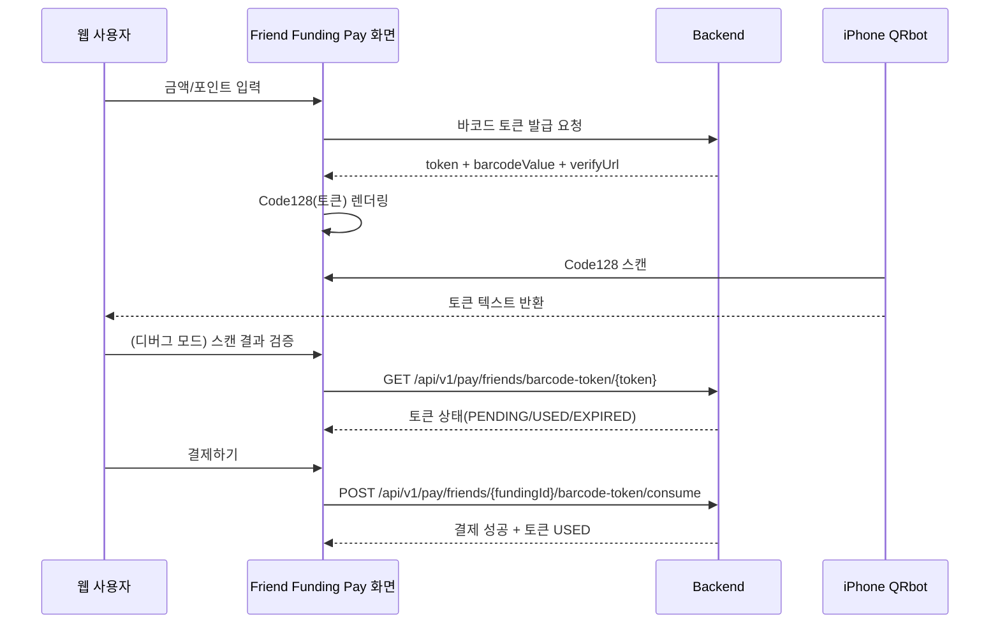

# FundingBoost-Client
FundingBoost 클라이언트 레포지토리

## 💡Commit Convention
-   feat : 새로운 기능 추가
-   fix : 버그 수정
-   docs : 문서 수정
-   style : 코드 포맷팅, 세미콜론 누락, 코드 변경이 없는 경우
-   refactor: 코드 리펙토링
-   test: 테스트 코드, 리펙토링 테스트 코드 추가
-   chore : 빌드 업무 수정, 패키지 매니저 수정

## 💡 PR Convetion

| 아이콘 | 코드                       | 설명                     |
| ------ | -------------------------- | ------------------------ |
| 🎨     | :art                       | 코드의 구조/형태 개선    |
| ⚡️    | :zap                       | 성능 개선                |
| 🔥     | :fire                      | 코드/파일 삭제           |
| 🐛     | :bug                       | 버그 수정                |
| 🚑     | :ambulance                 | 긴급 수정                |
| ✨     | :sparkles                  | 새 기능                  |
| 💄     | :lipstick                  | UI/스타일 파일 추가/수정 |
| ⏪     | :rewind                    | 변경 내용 되돌리기       |
| 🔀     | :twisted_rightwards_arrows | 브랜치 합병              |
| 💡     | :bulb                      | 주석 추가/수정           |
| 🗃      | :card_file_box             | 데이버베이스 관련 수정   |

## 💡CSS Convention
- 클래스명은 BEM(Block Element Modifier) 방식을 따른다.
- Block은 독립적인 컴포넌트의 이름으로 중첩되지 않는다.
- Element는 Block 내부의 구성 요소로 Block 이름을 접두사로 사용한다.
- Modifier는 Block 또는 Element의 상태를 나타내며 이름에 "-"를 사용한다.
- 클래스 이름에 네임스페이스를 사용하여 모듈 또는 컴포넌트를 구분한다.

## Code128 바코드 결제 + QRbot 테스트

### 동작 방식

### 엔드포인트
- 토큰 발급: `POST /api/v1/pay/friends/{fundingId}/barcode-token`
- 토큰 검증: `GET /api/v1/pay/friends/barcode-token/{token}`
- 토큰 결제: `POST /api/v1/pay/friends/{fundingId}/barcode-token/consume`

### UI 정책
- 기본 사용자 화면(`http://localhost/friend-funding/pay/:id`)에는 토큰/검증 URL/QRbot 입력 UI를 노출하지 않습니다.
- 결제 UX를 해치지 않도록 테스트 도구는 **디버그 모드에서만** 노출됩니다.

### 디버그 모드 켜기
- URL 쿼리: `?barcodeDebug=1`  
  예) `http://localhost/friend-funding/pay/5?barcodeDebug=1`
- 또는 빌드 환경변수: `REACT_APP_BARCODE_DEBUG=true`

### QRbot 로컬 테스트
1. 결제 페이지에서 금액을 입력해 Code128 바코드를 생성합니다.
2. iPhone QRbot으로 바코드를 스캔합니다.
3. 디버그 모드에서 스캔값(토큰 또는 URL)을 검증 입력란에 붙여넣고 검증합니다.
4. 결제 버튼 클릭 후 다시 검증하면 `USED` 상태를 확인할 수 있습니다.
